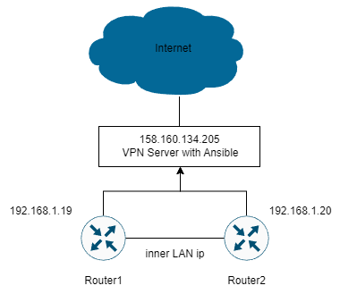

University: [ITMO University](https://itmo.ru/ru/) <br/>
Faculty: [FICT](https://fict.itmo.ru) <br/>
Course: [Network programming](https://github.com/itmo-ict-faculty/network-programming) <br/>
Year: 2023/2024 <br/>
Group: K34202 <br/>
Author: Donina Daria Dmitrievna <br/>
Lab: Lab2 <br/>
Date of create: 07.12.2023 <br/>
Date of finished: 07.12.2023 <br/>


# Цель работы
С помощью Ansible настроить несколько сетевых устройств и собрать информацию о них. Правильно собрать файл Inventory.

# Ход работы
### 1. Установка второго CHR и OVPN клиента.
Через VirtualBox создана новая машина Mikrotik CHR, затем на ней настроен второй OVPN client.
Клонировать Mikrotik CHR не удалось, при создании в новой машине отсутствовали сетевые интерфейсы, поэтому установлен Mikrotik CHR другой версии.


В итоге имеем 2 активных CHR подключенных к OVPN.


### 2. Настройка Ansible.

Ansible работает через ssh подключение, потому для начала стоит его настроить. Для этого в разделе IP=>SSH указать подключение без шифрования, а затем получить адресса машин относительно OVPN сервера.


Структура файла playbook.yml следующая:
```
--- //Начало yaml файла
  - name: Scenario name //Название, по которому понятно назначение playbook'а
    hosts: routers  //Группа хостов для которых будет выполняться сценарий
    tasks:
    - name: Name of task //Название действия
        community.routeros.command: //Модуль для выполнения команд
            commands: /system license print //Команды, как будто мы их вводим на 
                                            //прямую в Mikrotik 
            register: output    //Получение выходных данных и добавление их в 
                            //переменную с данным названием
    - name: Show output
        debug:
            var: output //Соответственно выводит все выходные данные
```
Для реализации playbook нужно:
1) Создать файл hosts с указанием ip'шников роутеров и переменных
Файл hosts.ini должен иметь следующий вид:
```
[routers]   //Определенное имя группы
first_Mikrotik ansible_host=1.1.1.1
second_Mikrotik ansible_host=1.1.1.1
//ansible_something - объявление глобальных переменных ansible, в данном
//они понадобятся для ssh-подключения

[routers:vars]
ansible_connection=ansible.netcommon.network_cli
ansible_network_os=community.routeros.routeros
ansible_user=admin
ansible_ssh_pass=admin
```

2) Создать сам playbook, для чего нужно найти команды для настройки Mikrotik:
    - Добавление пользователей;
    - Настройки NTP Client;
    - Настройки OSPF;
    - Сбор данных конфига и по топологии OSPF.

Добавлен файл hosts.


После того как найдены все нужные команды, создан файл playbook.


Он был запущен и получен следующий вывод:


Состояние микротиков изменилось


Отдельно проверена работа OSPF:


Схема сети выглядит следующим образом:



# Вывод
В ходе данной работы удалось создать еще один CHR и настроить на нем OVPN-клиент, написать сценарий для Ansible, настроить OSPF и NTP-клиент на двух роутерах.
