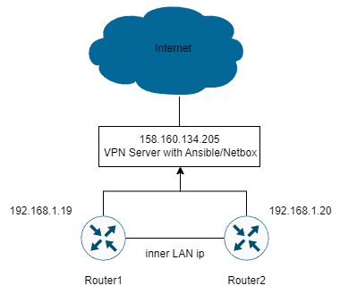

University: [ITMO University](https://itmo.ru/ru/) <br/>
Faculty: [FICT](https://fict.itmo.ru) <br/>
Course: [Network programming](https://github.com/itmo-ict-faculty/network-programming) <br/>
Year: 2023/2024 <br/>
Group: K34202 <br/>
Author: Donina Daria Dmitrievna <br/>
Lab: Lab3 <br/>
Date of create: 07.12.2023 <br/>
Date of finished: 07.12.2023 <br/>


# Цель работы
С помощью Ansible и Netbox собрать всю возможную информацию об устройствах и сохранить их в отдельном файле.

# Ход работы
### 1. Установка Netbox.
Для работы с Netbox утсановлен PostgreSQL.
```
sudo apt install postgresql libpq-dev -y
```
В PostgreSQL была создана новая база данных netbox и пользователь с аналогичным именем, которому были выданы максимальные права на управление этой базой.
```
CREATE DATABASE netbox;
CREATE USER netbox WITH ENCRYPTED password '1234';
GRANT ALL PRIVILEGES ON DATABASE netbox to netbox;
```
Установлен Redis.
```
sudo apt install -y redis-server
```
Скачен архив Netbox
```
wget https://github.com/netbox-community/netbox/archive/v3.4.1.tar.gz
tar -xzf v3.4.1.tar.gz -C /opt
```
Добавлен пользователь Netbox
```
sudo adduser --system --group netbox
sudo chown --recursive netbox /opt/netbox/netbox/media/
```
Установлены библиотеки python и создано виртуальное окружение
```
sudo apt-get install -y python3 python3-pip python3-venv python3-dev build-essential libxml2-dev libxslt1-dev libffi-dev libpq-dev libssl-dev zlib1g-dev
python3 -m venv /opt/netbox/venv
source venv/bin/activate
pip3 install -r requirements.txt
```
Сгенерирован секретный ключ, который необходимо будет вставить в конфигурацию
```
python3 netbox/generate_secret_key.py
```
Создан файл конфигурации с полями ALLOWED_HOSTS, DATABASE, SECRET_KEY с ключом выше и параметрами созданной бд
```
sudo nano configuration.py
```
```
ALLOWED_HOSTS = ['*']
DATABASE = {
  'NAME':
  'USER':
  'netbox'
  'netbox'
  'PASSWORD': '1234'
  'HOST': 'localhost', 'PORT': '',
  'CONN_MAX_AGE': 300,
}
SECRET_KEY = ""
```
Проведена миграция базы данных
```
source venv/bin/activate
python3 manage.py migrate
```
Создан суперпользователь для дальнейшего управления netbox.
```
python3 manage.py createsuperuser
```
Собрана статистика
```
python3 manage.py collectstatic --no-input
```
Также установлен Ansible для Netbox. Для возможности запуска netbox были сконфигурированы nginx и gunicorn
```
ansible-galaxy collection install netbox.netbox
sudo apt-get install -y nginx
sudo cp /opt/netbox/contrib/nginx.conf /etc/nginx/sites-available/netbox
cd /etc/nginx/sites-enabled/
sudo rm default
sudo ln -s /etc/nginx/sites-available/netbox
sudo nginx -t
sudo nginx -s reload
sudo cp contrib/gunicorn.py /opt/netbox/gunicorn.py
sudo cp contrib/*.service /etc/systemd/system/
sudo systemctl daemon-reload
sudo systemctl start netbox netbox-rq
sudo systemctl enable netbox netbox-rq
```
Запущен сервер Netbox:
```
python3 manage.py runserver 0.0.0.0:8000 --insecure
```
После этого можно открыть графический интерфейс netbox по адресу http://IP_сервера:8000.


### 2. Добавление инфомации о роутерах.
С помощью графического интерфейса виртуальные маршрутизаторы из предыдущих лабораторных работ были внесены в раздел Virtual Machines, о них были добавлены все имеющиеся сведения.


### 3. Сохранение данных из Netbox.
Был создан новый инвентарный файл, который динамически получает данные из API Netbox. Подключение производилось с помощью сгенерированного в Netbox идентификационного токена.
```netbox_inventory.yml
plugin: netbox.netbox.nb_inventory
api_endpoint: http://127.0.0.1:8000
token: <netbox account token>
validate_certs: True
config_context: False
interfaces: True
```

В результате выполнения получается YAML файл, который и является файлом инвентаря для Ansible. Вся информация сохранена в файл nb_inventory.yml.
### 4. Написание сценариев.

Был написан playbook для изменения имени и добавления ip-адреса на устройство
```
- name: Set CHR
  hosts: ungrouped
  tasks:
    - name: Set Name
      community.routeros.command:
        commands:
          - /system identity set name="{{interfaces[0].device.name}}"
    - name: Set IP
      community.routeros.command:
        commands:
        - /ip address add address="{{interfaces[0].ip_addresses[1].address}}" interface="{{interfaces[0].display}}"
```
Playbook запущен командой `ansible-playbook -i inventory playbook.yml` и после этого имена и IP-адреса роутеров изменены


Создан playbook для получения серийного номера CHR и установки его в профиль Netbox
```
- name: Serial Numbers
  hosts: ungrouped
  tasks:
    - name: Serial Number
      community.routeros.command:
        commands:
          - /system license print
      register: license_print
    - name: Name
      community.routeros.command:
        commands:
          - /system identity print
      register: identity_print
    - name: Serial Number to Netbox
      netbox_device:
        netbox_url: http://127.0.0.1:8000
        netbox_token: <API token>
        data:
          name: "{{identity_print.stdout_lines[0][0].split(' ').1}}"
          serial: "{{license_print.stdout_lines[0][0].split(' ').1}}"
```
SerialNumber добавлен в Netbox:


Схема полученной сети:

# Вывод
В ходе данной работы был поднят Netbox, собрана информация об устройствах и сохранена в отдельном файле с помощью Ansible и Netbox, а также была произведена настройка роутеров с помощью playbook-ов
на основе собранных данных.
